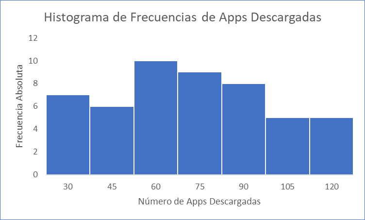
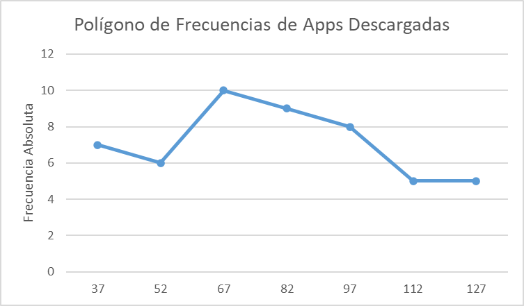
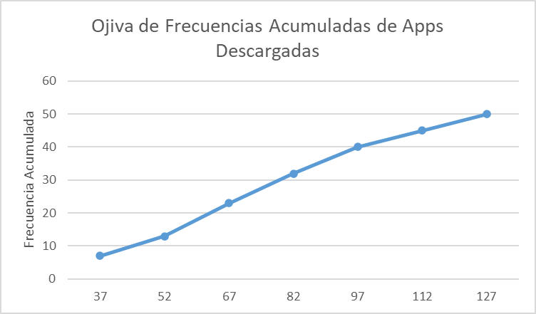

# 📊 Taller No. 3 – Análisis Estadístico de Datos y Distribución de Frecuencias

<div align="center">
  

  <br><br>

  
  
  
  

</div>

---

## 📋 Información Académica

| | |
| :--- | :--- |
| **Institución** | Universidad del Pacífico |
| **Programa** | Ingeniería de Sistemas |
| **Asignatura** | Inteligencia Artificial |
| **Docente** | Ing. Wilman Valencia |
| **Fecha de entrega** | 15 de junio de 2026 |

### 👨‍💻 Autor

- **Jhon Jader Riascos Angulo**

---

## 📌 Descripción del Proyecto

Este repositorio contiene el desarrollo del **Taller No. 3: Análisis Estadístico de Datos y Distribución de Frecuencias**, enfocado en el estudio de la variable **Apps Descargadas** a partir de una muestra de 50 usuarios.

Durante el desarrollo del taller se aplicaron conceptos fundamentales de estadística descriptiva para organizar, resumir e interpretar la información mediante tablas de frecuencia y representaciones gráficas.

> **Objetivo Principal:** Analizar el comportamiento de la variable *Apps Descargadas* mediante técnicas de distribución de frecuencias y visualización estadística.

---

## 🎯 Objetivos

### Objetivo General

Realizar un análisis estadístico descriptivo de la variable **Apps Descargadas** mediante técnicas de distribución de frecuencias y representación gráfica.

### Objetivos Específicos

- Identificar las características principales del conjunto de datos.
- Construir una tabla de distribución de frecuencias.
- Interpretar gráficamente el comportamiento de las descargas de aplicaciones.
- Analizar patrones y tendencias presentes en los datos.

---

## 📊 Resumen Estadístico

| Concepto | Valor |
| :--- | :---: |
| Total de datos | 50 |
| Valor mínimo | 30 |
| Valor máximo | 132 |
| Rango | 102 |
| Número de clases | 7 |
| Regla de Sturges | 6.64 |
| Amplitud calculada | 14.57 |
| Amplitud utilizada | 15 |

---

## 📈 Distribución de Frecuencias

| Límite Inferior | Límite Superior | Marca de Clase | Frecuencia Absoluta | Frecuencia Relativa | Frecuencia Acumulada | Frecuencia Relativa Acumulada |
| :---: | :---: | :---: | :---: | :---: | :---: | :---: |
| 30 | 44 | 37 | 7 | 14,00% | 7 | 14,00% |
| 45 | 59 | 52 | 6 | 12,00% | 13 | 26,00% |
| 60 | 74 | 67 | 10 | 20,00% | 23 | 46,00% |
| 75 | 89 | 82 | 9 | 18,00% | 32 | 64,00% |
| 90 | 104 | 97 | 8 | 16,00% | 40 | 80,00% |
| 105 | 119 | 112 | 5 | 10,00% | 45 | 90,00% |
| 120 | 134 | 127 | 5 | 10,00% | 50 | 100,00% |
| **Total** |  |  | **50** | **100,00%** |  |  |

### 🔍 Interpretación

El intervalo con mayor frecuencia corresponde a **60–74 aplicaciones descargadas**, con una frecuencia absoluta de **10 usuarios**, representando el **20%** de la muestra. Esto indica que la mayor concentración de usuarios realiza una cantidad moderada de descargas.

Por otra parte, los intervalos **105–119** y **120–134** presentan las frecuencias más bajas, evidenciando que pocos usuarios alcanzan cantidades muy elevadas de aplicaciones descargadas.

---

## 📉 Histograma de Frecuencias

<div align="center">
    
</div>

### 🔍 Interpretación

El histograma permite visualizar la distribución de las descargas de aplicaciones mediante barras agrupadas por intervalos.

Se observa una mayor concentración de datos entre los intervalos **60–74** y **75–89**, indicando que la mayoría de los usuarios mantiene una cantidad intermedia de aplicaciones descargadas.

La distribución no es completamente uniforme, ya que existen menos observaciones en los extremos inferiores y superiores.

---

## 📈 Polígono de Frecuencias

<div align="center">
    
</div>

### 🔍 Interpretación

El polígono de frecuencias muestra la evolución de las frecuencias absolutas entre los diferentes intervalos.

La gráfica evidencia un aumento progresivo hasta alcanzar el punto máximo en la marca de clase **67**, correspondiente al intervalo **60–74 aplicaciones descargadas**. Posteriormente, la frecuencia disminuye gradualmente.

Esto indica que la distribución presenta un comportamiento relativamente concentrado alrededor de los valores medios.

---

## 📊 Ojiva o Curva Acumulada

<div align="center">
    
</div>

### 🔍 Interpretación

La ojiva representa el crecimiento acumulado de las frecuencias correspondientes al número de aplicaciones descargadas.

A través de la gráfica se observa que:

- Hasta la marca de clase **37** se acumulan **7 usuarios**.
- Hasta la marca de clase **52** se acumulan **13 usuarios**.
- Hasta la marca de clase **67** se acumulan **23 usuarios**.
- Hasta la marca de clase **82** se acumulan **32 usuarios**.
- Hasta la marca de clase **97** se acumulan **40 usuarios**.
- Hasta la marca de clase **112** se acumulan **45 usuarios**.
- Finalmente, en la marca de clase **127** se alcanza el total de **50 usuarios analizados**.

Esto evidencia el crecimiento progresivo de la frecuencia acumulada a medida que aumentan los intervalos de aplicaciones descargadas.

---

## 🧠 Análisis General

| Pregunta | Resultado |
| :--- | :--- |
| Intervalo con mayor concentración | 60 – 74 aplicaciones |
| Frecuencia máxima | 10 usuarios |
| Porcentaje correspondiente | 20% |
| Usuarios por debajo de 90 aplicaciones | 64% |
| Tendencia observada | Ligero sesgo hacia la derecha |
| Comportamiento predominante | Concentración en valores medios |

---

## 🏆 Conclusiones

- La variable **Apps Descargadas** presenta una distribución concentrada en valores medios.
- El intervalo de mayor frecuencia fue **60–74 aplicaciones descargadas**.
- La mayoría de usuarios descarga menos de **90 aplicaciones móviles**.
- Las representaciones gráficas facilitaron la interpretación visual del comportamiento de los datos.
- El análisis estadístico descriptivo permitió identificar patrones relevantes en el uso de aplicaciones móviles por parte de los usuarios estudiados.

---

## 📁 Estructura del Proyecto

```text
📦 Taller3_Apps_Descargadas
 ┣ 📄 README.md
 ┣ 📄 Taller3_Estadistica_informe.pdf
 ┣ 📊 Taller3_Estadistica.xlsx
 ┗ 📁 images
    ┣ 📈 histograma.png
    ┣ 📈 poligono.png
    ┗ 📈 ojiva.png
```

---

## 📚 Referencias

- Lifeder. Regla de Sturges.
- Microsoft Excel. Creación de histogramas.
- Automate Excel. Construcción de ojivas.
- Normas APA 7 para tablas y figuras.